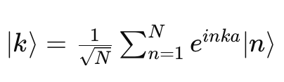
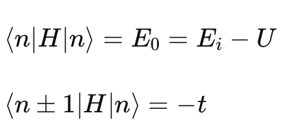

# Documentación de Tight Binding

Este proyecto incluye implementaciones del modelo de Tight Binding y versiones paralelizadas para mejorar el rendimiento.

## Introducción al Método de Tight Binding

## Descripción del Proyecto

El modelo de tight binding (o enlace fuerte) se utiliza para describir la estructura de bandas electrónicas en sólidos cristalinos. En este proyecto, consideramos una cadena atómica infinita con un orbital atómico por átomo.

### Conceptos Clave

- **Parámetro de red : a :** La distancia entre celdas unidad.
- **Parámetro de hopping : t :** La probabilidad de que un electrón salte de un orbital a su vecino.
- **Combinación de orbitales atómicos :** Se utiliza la combinación lineal de orbitales atómicos para describir el estado del sistema.

### Ecuaciones Fundamentales

El modelo se basa en las siguientes ecuaciones:

Donde *N* es el total de sitios y *k* es un número real en el espacio recíproco.

La matriz hamiltoniana dependiente del parámetro k se diagonaliza para obtener la energía del sistema:

### Objetivos y Metas

1. Construir la matriz hamiltoniana dependiente del parámetro \(k\).
2. Diagonalizar la matriz hamiltoniana para obtener la energía del sistema.
3. Utilizar la función de autovalores para optimizar la diagonalización de la matriz.
4. Implementar el algoritmo en Python.
5. Implementar la solución en paralelo para acelerar el algoritmo y evaluar la aceleración.

## Contenidos

- [Uso](uso.md)
- [Resultados](resultados.md)
