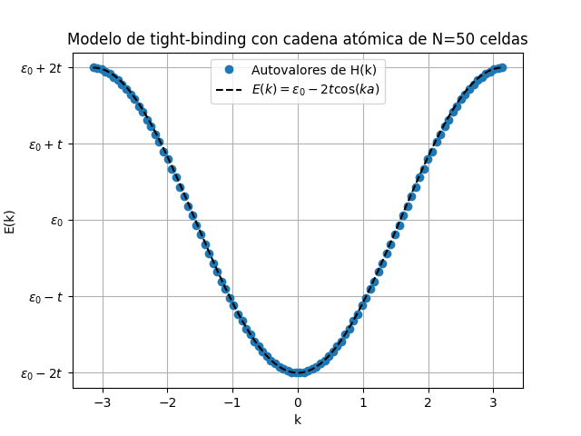
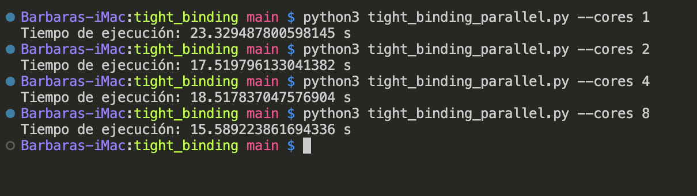
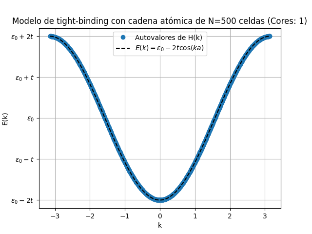
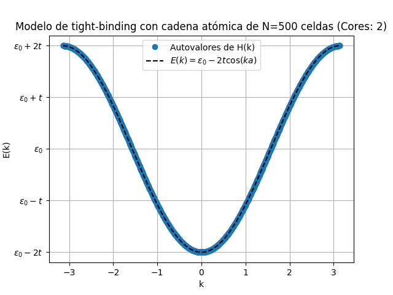
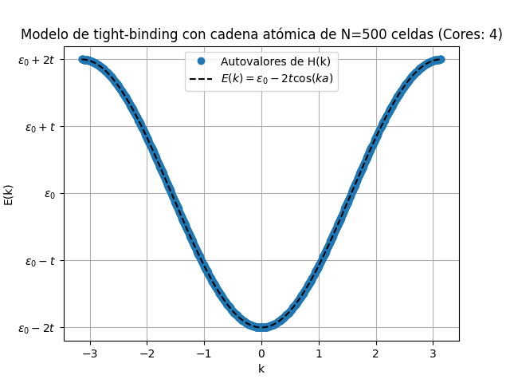
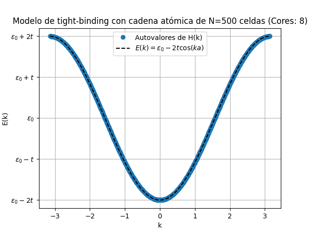

# Resultados

Esta sección presenta los resultados obtenidos al ejecutar los scripts.

## Implementación Serial

## Implementación Paralela

La implementación paralela se probó con diferentes números de núcleos. A continuación se presentan los resultados:

### 1 Núcleo

### 2 Núcleos

### 4 Núcleos

### 8 Núcleos

